# Unity Game Development Summary

| Field | Detail |
|---|---|
| **Game Title** |Hermit Hunter|
| **Student Name(s)** |Douglas Percival |
| **Class / Course** |Computer Technologies YR10 2026 term  |
| **Repository** | 2026CT_GameDesign_Appendages_Douglas.P|
| **Unity Version** |6000.0.58f1 |
| **Document Version** |0.9.0 |
| **Date** |24/09/2026|

---

## Table of Contents
1. [Game Overview](#1-game-overview)
2. [Video Walkthrough](#2-video-walkthrough)
3. [Game Mechanics](#3-game-mechanics)
4. [Visual Features](#4-visual-features)
5. [Audio Design](#5-audio-design)
6. [User Interface & HUD](#6-user-interface--hud)
7. [Scene & Level Design](#7-scene--level-design)
8. [Scripts & Programming](#8-scripts--programming)
9. [Development Techniques & Tutorials Acknowledged](#9-development-techniques--tutorials-acknowledged)
10. [Third-Party Content Acknowledgements](#10-third-party-content-acknowledgements)
11. [Challenges & Solutions](#11-challenges--solutions)
12. [Branch Development Summary](#12-branch-development-summary)

---

## 1. Game Overview

### 1.1 Genre
Hermit hunter is an platforming style dark comedy exploration game. 
The player will attempt to explore the map to gather collectables that are in reality human limbs while doing parkour using simple mechanics to avoid death and reach new areas.
The games style takes inspiriraton from games like "kindergarten" and "Dave the Diver" to get its colourful pallete but slightly darker references to bodys or limbs that are nevertheless referred to lightly.
certain elements of the games UI take inspiration from the Souls-Like game "ELDEN RING" in both the style of the menu and the death animation,
this is nothing but a playful referrence the other game.

### 1.2 Target Audience
The target audience for the game is preteens who find humour in slightly macabre scenareos but arent actaully looking for anything dark or horrific.
its a light hearted platformer game that is moderately difficult and uses some dark elements for humour.
We chose the audience because we wanted to replicate a game like dave the diver but with some dark comedy undertones, however this audience comes with the limitation of not being able to go too dark or gorey as our audience is young, we must also be careful to finely adjust the difficulty for our players as their moter skills are not highly devoloped.

### 1.3 Game Summary
The Player spawns in next to a "MORG"(morgue) with a strange creature inside asking the player to track down lost limbs, the player will then explore the map and collect the items as they find them and return them to the MORG in order to complete the level, all the while utilising parkour mechanics to avoid dangerous spikes and get to new locations to collect hard to reach limbs, after collecting all limbs the player must return to the MORG where they will be sent to the next level.

### 1.4 Win / Loss Conditions
| Condition | Description |
|---|---|
| Win |Collect all 6 body parts and make it to the MORG |
| Loss | Touch a spike |

### 1.5 Platform & Build Settings - ask jones
| Setting | Detail |
|---|---|
| Target Platform | |
| Resolution | |
| Build Type | |

---

## 2. Video Walkthrough

### 2.1 Full Gameplay Walkthrough

<!--
  Embed a YouTube/Vimeo video or link to a file in the repository.
  YouTube embed syntax:
  
HermitHunter2dGame(https://img.youtube.com/vi/SUJwRp6EE3o/0.jpg)](https://www.youtube.com/watch?v=SUJwRp6EE3o)

  OR link to a local file:
  [Watch Walkthrough Video](./docs/video/walkthrough.mp4)
-->

| Field | Detail |
|---|---|
| **Video Title** | HermitHunter2dGame |
| **Link / Embed** |https://www.youtube.com/watch?v=SUJwRp6EE3o
| **Duration** |1:59 |
| **Description** |Walkthrough of my game, showing most of the features with narration of what they are. youtube description is "Game made for Ct project 2026"|

### 2.2 Feature Highlight Clips  - ask jones

| Clip | Description | Link |
|---|---|---|
| | | |
| | | |
| | | |

---

## 3. Game Mechanics

### 3.1 Core Mechanics
| ID | Mechanic | Description | Implemented In (Script/Object) |
|---|---|---|---|
| M-1 |Double Jump Bubbles |These little bubbles can be jumped on as if they were solid ground, but standing still will cause the player to fall through, making for unique parkour|BooblePREFAB, no script, just tagged as ground with the collider set to trigger|
| M-2 |Death |the player dies, this can happen when it touches a spike, or in the full build if it falls off the map, an animation plays, movement is frozen, then the scene resets |"Death" script contains the code for the death itself, actually causing it can be called in any script, but is currently called in player controller |
| M-3 |Collections |the player touches an item and it appears in the inventory on the top left|"Item_Collector" Script on the player |
| M-4 |Depot |a small building that the player can walk into to check off the collected items, have an npc talk to the player, or finish the level |Droppoff script on Depot object |
| M-5 |Parralax |as the player moves across the world objects in the background appear to move slower than in the foreground |achived by setting camera projection to perspective and then using 3d scene editor to actually place certain objects further back |

### 3.2 Player Controls
| Action | Input (Keyboard / Controller) | Description |
|---|---|---|
|Left/Right movement |AD or arrow keys | these keys allow the player to move left or right |
|Jump |Space |Can be done while on the ground or while touching a bubble while falling in midair |
|Buttons | mouse|click buttons on the homescreen with your mouse |

### 3.3 Physics & Collision
| Feature | Description |
|---|---|
|Bubble collisons |The bubbles are layered in the ground layer but their hitbox is only a trigger, this means that they check the "isground" check in the player controller and allow the player to jump while touching them, but arent considered something the player can stand on or walk over because the hitbox only triggers this function |
|Spike collison |in the player controller  script if the player is detected touching something with the  "Evil" tag, then it will play the death function |
|Player gravity | the player has gravity due to the rigidbody 2d and box collider 2d components, the players Z rotation is also frozen to prevent tipping over when on a ledge|

### 3.4 Game Loop
| Stage | Description |
|---|---|
| Start / Initialisation | The player loads into the level and meets the NPC who asks them to search the level for limbs|
| Core Loop | The player searches the level and returns the limbs to the NPC to get dialoge and have their collected items checked off|
| Win / End State |The player collects all Limbs and returns them to the NPC without Dying |
| Restart |The player dies on a spike and restarts the level OR wins and the next level startswhere the process repeats |

### 3.5 Scoring & Progression
| Element | Description |
|---|---|
| Scoring System |The amount of limbs you have are recorded in the top left corner, if you visit the MORG without all the limbs than the ones you have will be covered with a smiley face, in a later build of the game the smiley face could mean you wont lose that limb when you die |
| Difficulty Progression |Certain limbs are harder skillwise and more dangerous (spikes) to reach than others, acting as difficulty for the game |
| Unlockables / Levels |There is one secondary level that the player can load into, however any amount of levels could be created and cutscenes could be added |

---

## 4. Visual Features

### 4.1 Particle Effects

| Effect Name | Purpose | Screenshot |
|---|---|---|
|Standing Bubbles |Small trail of bubbles that constantly emit from the player for aesthetic purposes |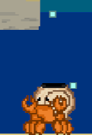 |
|Death Bubbles |Huge amount of bubbles released when the player dies that fade from red to blue to signifiy death |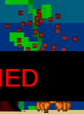 |

---

### 4.2 Cut Scenes & Cinematics - ask jones what to write

| Cut Scene | Trigger | Description | Screenshot / Still |
|---|---|---|---|
| | | | |
| | | | |
| | | | |

---

### 4.3 Animations

| Animation | Object / Character | Description | Screenshot |
|---|---|---|---|
|Idle Bob |HermitPlayer|a little animation of the player bobbing up and down while it stands still |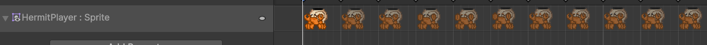 |
|FallingScaddle |HermitPlayer |While the player falls the crab wiggles its legs |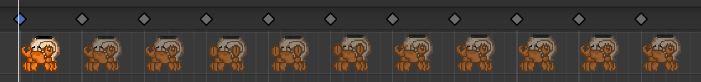 |
|BackgroundFish |backgroundFish |small animation of fish swimming in schools in the background, right now its just a placeholder |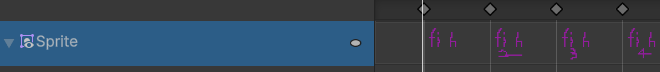 |

---

### 4.4 Lighting & Post-Processing

| Feature | Description | Screenshot |
|---|---|---|
| | | |
| | | |
| | | |

---

### 4.5 Shaders & Materials

| Shader / Material | Applied To | Description | Screenshot |
|---|---|---|---|
|Frictionless 2d |Player |Makes the player less likely to get stuck on or between walls due to no friction   |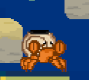 |

---

### 4.6 Additional Visual Screenshots

| Description | Screenshot |
|---|---|
|Death Screen |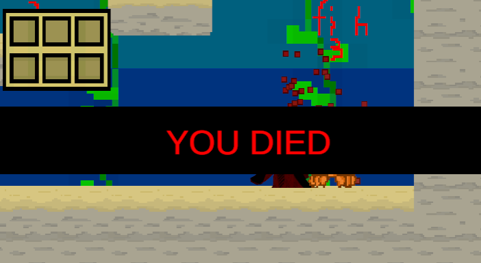 |
|Smile Coverings |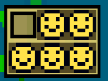 |
|MORG | 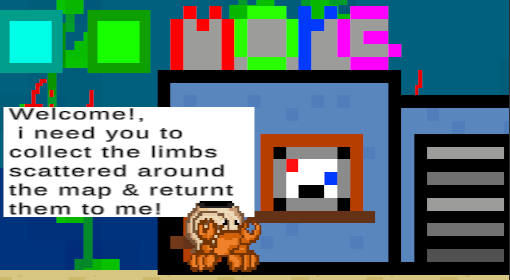|

---

## 5. Audio Design - ask jones

N/A, This game has NO audio as we were unable to create good enough sound effects that matched the underwater theme, furthermore the multimedia student on the proect didnt have music experience, and so i was given no audio to implement.

---

## 6. User Interface & HUD

### 6.1 HUD Elements
| Element | Purpose | Screenshot |
|---|---|---|
|Inventory|Shows what you have and havent collected | 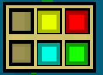|
|Smiles |Shows what items you had when you last returned to the MORG |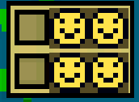 |

> Add screenshot images using: ``

### 6.2 Menus
| Menu | Purpose | Screenshot |
|---|---|---|
| Main Menu |allows the player to begin the game or exit, more features could be added | 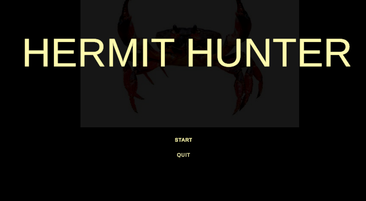|
| Game Over Screen |Shows that the player is dead | 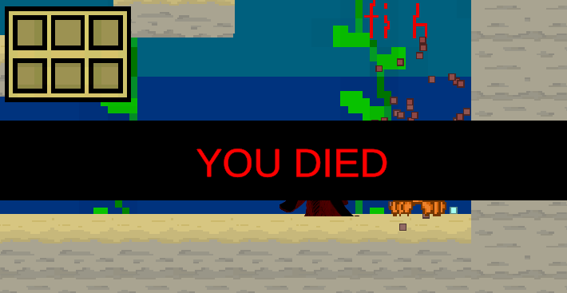|

> Add screenshot images using: ``

---

## 7. Scene & Level Design

### 7.1 Scene List
| Scene Name | Purpose | Description |
|---|---|---|
| | | |
| | | |
| | | |
| | | |

### 7.2 Level / Environment Screenshots
| Level / Area | Description | Screenshot |
|---|---|---|
| | | |
| | | |
| | | |

> Add screenshot images using: ``

### 7.3 Scene Management
| Feature | Description |
|---|---|
| Scene Loading Method | |
| Persistent Data Between Scenes | |
| Scene Transition Effects | |

---

## 8. Scripts & Programming

### 8.1 Script Summary
| Script Name | Attached To | Responsibility |
|---|---|---|
| | | |
| | | |
| | | |
| | | |
| | | |

### 8.2 Key Algorithms / Logic
| Feature | Script | Description |
|---|---|---|
| | | |
| | | |
| | | |

### 8.3 Design Patterns Used
| Pattern | Where Applied | Justification |
|---|---|---|
| | | |
| | | |
| | | |

---

## 9. Development Techniques & Tutorials Acknowledged

> List every tutorial, course, video, or article that informed or guided your implementation. Include what you used it for and what you changed or adapted.

| # | Title | Author / Creator | URL / Source | What You Used It For | What You Changed / Adapted |
|---|---|---|---|---|---|
| 1 | | | | | |
| 2 | | | | | |
| 3 | | | | | |
| 4 | | | | | |
| 5 | | | | | |
| 6 | | | | | |
| 7 | | | | | |
| 8 | | | | | |

---

## 10. Third-Party Content Acknowledgements

> All third-party assets (art, audio, fonts, scripts, packages) must be listed here with their licence. Using an asset without acknowledgement may constitute academic misconduct.

### 10.1 Visual Assets
| Asset Name | Type | Creator / Source | Licence | URL | Used For |
|---|---|---|---|---|---|
| | | | | | |
| | | | | | |
| | | | | | |

### 10.2 Audio Assets
| Asset Name | Type | Creator / Source | Licence | URL | Used For |
|---|---|---|---|---|---|
| | | | | | |
| | | | | | |
| | | | | | |

### 10.3 Scripts & Code Snippets
| Script / Snippet | Source | Licence | URL | Used For | Changes Made |
|---|---|---|---|---|---|
| | | | | | |
| | | | | | |

### 10.4 Unity Packages & Plugins
| Package Name | Version | Source | Licence | URL | Purpose |
|---|---|---|---|---|---|
| | | | | | |
| | | | | | |
| | | | | | |

### 10.5 Fonts
| Font Name | Creator / Source | Licence | URL |
|---|---|---|---|
| | | | |
| | | | |

---

## 11. Challenges & Solutions

| # | Challenge Encountered | How It Was Solved |
|---|---|---|
| 1 | | |
| 2 | | |
| 3 | | |
| 4 | | |
| 5 | | |

---

## 12. Branch Development Summary

> One section per feature branch. Add or remove sections to match your repository. Branches should be named for the feature they implement e.g. `feature/player-movement`. Link each branch name directly to the branch in your GitHub repository.

---

### Branch 1 — `main`

| Field | Detail |
|---|---|
| **Branch Name** | `main` |
| **Purpose** | Stable, releasable version of the game |
| **Merged From** | |
| **Final Commit** | |

---

### Branch 2 — `feature/`

| Field | Detail |
|---|---|
| **Branch Name** | |
| **Feature Developed** | |
| **Merged Into** | |
| **Date Started** | |
| **Date Merged** | |

#### What Was Built
<!-- Describe what this branch added or changed -->

#### Key Commits
| Commit Message | What Changed |
|---|---|
| | |
| | |
| | |

#### Problems Encountered & Resolved
| Problem | Resolution |
|---|---|
| | |
| | |

#### Screenshot / Evidence
<!-- Add a screenshot of the feature working -->
> ``

---

### Branch 3 — `feature/`

| Field | Detail |
|---|---|
| **Branch Name** | |
| **Feature Developed** | |
| **Merged Into** | |
| **Date Started** | |
| **Date Merged** | |

#### What Was Built

#### Key Commits
| Commit Message | What Changed |
|---|---|
| | |
| | |
| | |

#### Problems Encountered & Resolved
| Problem | Resolution |
|---|---|
| | |
| | |

#### Screenshot / Evidence
> ``

---

### Branch 4 — `feature/`

| Field | Detail |
|---|---|
| **Branch Name** | |
| **Feature Developed** | |
| **Merged Into** | |
| **Date Started** | |
| **Date Merged** | |

#### What Was Built

#### Key Commits
| Commit Message | What Changed |
|---|---|
| | |
| | |
| | |

#### Problems Encountered & Resolved
| Problem | Resolution |
|---|---|
| | |
| | |

#### Screenshot / Evidence
> ``

---

### Branch 5 — `feature/`

| Field | Detail |
|---|---|
| **Branch Name** | |
| **Feature Developed** | |
| **Merged Into** | |
| **Date Started** | |
| **Date Merged** | |

#### What Was Built

#### Key Commits
| Commit Message | What Changed |
|---|---|
| | |
| | |
| | |

#### Problems Encountered & Resolved
| Problem | Resolution |
|---|---|
| | |
| | |

#### Screenshot / Evidence
> ``

---

### Branch 6 — `feature/`

| Field | Detail |
|---|---|
| **Branch Name** | |
| **Feature Developed** | |
| **Merged Into** | |
| **Date Started** | |
| **Date Merged** | |

#### What Was Built

#### Key Commits
| Commit Message | What Changed |
|---|---|
| | |
| | |
| | |

#### Problems Encountered & Resolved
| Problem | Resolution |
|---|---|
| | |
| | |

#### Screenshot / Evidence
> ``

---

### Branch Development Overview

> Complete this summary table once all branches are finished.

| Branch Name | Feature | Date Started | Date Merged | Status |
|---|---|---|---|---|
| `main` | Stable release | | | |
| `feature/` | | | | |
| `feature/` | | | | |
| `feature/` | | | | |
| `feature/` | | | | |
| `feature/` | | | | |

---

> **Student Declaration:** All work submitted is my own except where explicitly acknowledged above.