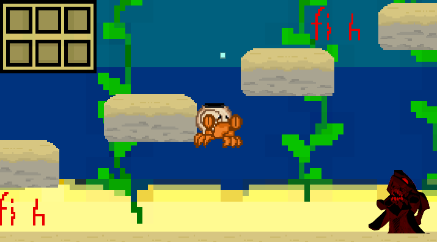
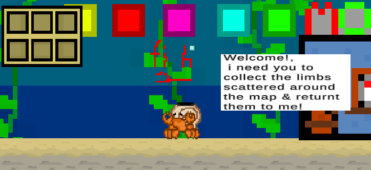
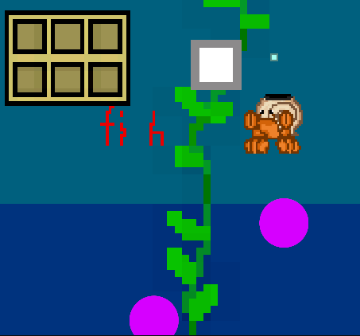
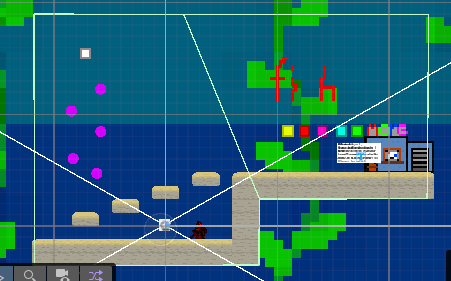
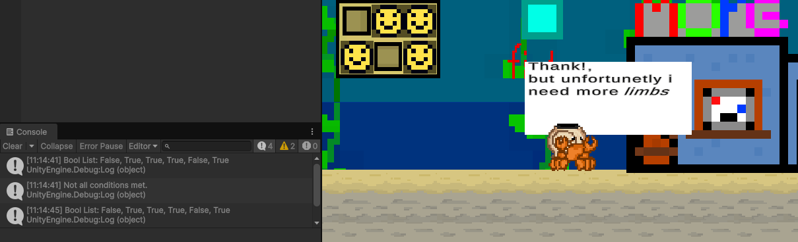
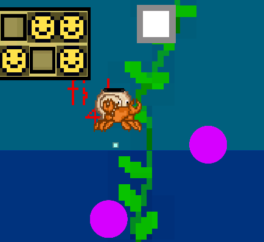

# Unity Game Development Summary

| Field | Detail |
|---|---|
| **Game Title** |Hermit Hunter|
| **Student Name(s)** |Douglas Percival |
| **Class / Course** |Computer Technologies YR10 2026 term  |
| **Repository** | 2026CT_GameDesign_Appendages_Douglas.P|
| **Unity Version** |6000.0.58f1 |
| **Document Version** |0.9.0 |
| **Date** |24/09/2026|

---

## Table of Contents
1. [Game Overview](#1-game-overview)
2. [Video Walkthrough](#2-video-walkthrough)
3. [Game Mechanics](#3-game-mechanics)
4. [Visual Features](#4-visual-features)
5. [Audio Design](#5-audio-design)
6. [User Interface & HUD](#6-user-interface--hud)
7. [Scene & Level Design](#7-scene--level-design)
8. [Scripts & Programming](#8-scripts--programming)
9. [Development Techniques & Tutorials Acknowledged](#9-development-techniques--tutorials-acknowledged)
10. [Third-Party Content Acknowledgements](#10-third-party-content-acknowledgements)
11. [Challenges & Solutions](#11-challenges--solutions)
12. [Branch Development Summary](#12-branch-development-summary)

---

## 1. Game Overview

### 1.1 Genre
Hermit hunter is an platforming style dark comedy exploration game. 
The player will attempt to explore the map to gather collectables that are in reality human limbs while doing parkour using simple mechanics to avoid death and reach new areas.
The games style takes inspiriraton from games like "kindergarten" and "Dave the Diver" to get its colourful pallete but slightly darker references to bodys or limbs that are nevertheless referred to lightly.
certain elements of the games UI take inspiration from the Souls-Like game "ELDEN RING" in both the style of the menu and the death animation,
this is nothing but a playful referrence the other game.

### 1.2 Target Audience
The target audience for the game is preteens who find humour in slightly macabre scenareos but arent actaully looking for anything dark or horrific.
its a light hearted platformer game that is moderately difficult and uses some dark elements for humour.
We chose the audience because we wanted to replicate a game like dave the diver but with some dark comedy undertones, however this audience comes with the limitation of not being able to go too dark or gorey as our audience is young, we must also be careful to finely adjust the difficulty for our players as their moter skills are not highly devoloped.

### 1.3 Game Summary
The Player spawns in next to a "MORG"(morgue) with a strange creature inside asking the player to track down lost limbs, the player will then explore the map and collect the items as they find them and return them to the MORG in order to complete the level, all the while utilising parkour mechanics to avoid dangerous spikes and get to new locations to collect hard to reach limbs, after collecting all limbs the player must return to the MORG where they will be sent to the next level.

### 1.4 Win / Loss Conditions
| Condition | Description |
|---|---|
| Win |Collect all 6 body parts and make it to the MORG |
| Loss | Touch a spike |

### 1.5 Platform & Build Settings
| Setting | Detail |
|---|---|
| Target Platform |Windows |
| Build Type |Release build |

---

## 2. Video Walkthrough

### 2.1 Full Gameplay Walkthrough

<!--
  Embed a YouTube/Vimeo video or link to a file in the repository.
  YouTube embed syntax:
  
HermitHunter2dGame(https://img.youtube.com/vi/SUJwRp6EE3o/0.jpg)](https://www.youtube.com/watch?v=SUJwRp6EE3o)

  OR link to a local file:
  [Watch Walkthrough Video](./docs/video/walkthrough.mp4)
-->

| Field | Detail |
|---|---|
| **Video Title** | HermitHunter2dGame |
| **Link / Embed** |https://www.youtube.com/watch?v=SUJwRp6EE3o
| **Duration** |1:59 |
| **Description** |Walkthrough of my game, showing most of the features with narration of what they are. youtube description is "Game made for Ct project 2026"|

### 2.2 Feature Highlight Clips 

| Clip | Description | Link |
|---|---|---|
|0.55 |Bubble jump feature gameplay |https://www.youtube.com/watch?v=SUJwRp6EE3o |
|1.07 |Dropping off items at the MORG before the text changes |https://www.youtube.com/watch?v=SUJwRp6EE3o |
|1.26 |Example of the death feature, player falls on spike and dies |https://www.youtube.com/watch?v=SUJwRp6EE3o |

---

## 3. Game Mechanics

### 3.1 Core Mechanics
| ID | Mechanic | Description | Implemented In (Script/Object) |
|---|---|---|---|
| M-1 |Double Jump Bubbles |These little bubbles can be jumped on as if they were solid ground, but standing still will cause the player to fall through, making for unique parkour|BooblePREFAB, no script, just tagged as ground with the collider set to trigger|
| M-2 |Death |the player dies, this can happen when it touches a spike, or in the full build if it falls off the map, an animation plays, movement is frozen, then the scene resets |"Death" script contains the code for the death itself, actually causing it can be called in any script, but is currently called in player controller |
| M-3 |Collections |the player touches an item and it appears in the inventory on the top left|"Item_Collector" Script on the player |
| M-4 |Depot |a small building that the player can walk into to check off the collected items, have an npc talk to the player, or finish the level |Droppoff script on Depot object |
| M-5 |Parralax |as the player moves across the world objects in the background appear to move slower than in the foreground |achived by setting camera projection to perspective and then using 3d scene editor to actually place certain objects further back |

### 3.2 Player Controls
| Action | Input (Keyboard / Controller) | Description |
|---|---|---|
|Left/Right movement |AD or arrow keys | these keys allow the player to move left or right |
|Jump |Space |Can be done while on the ground or while touching a bubble while falling in midair |
|Buttons | mouse|click buttons on the homescreen with your mouse |

### 3.3 Physics & Collision
| Feature | Description |
|---|---|
|Bubble collisons |The bubbles are layered in the ground layer but their hitbox is only a trigger, this means that they check the "isground" check in the player controller and allow the player to jump while touching them, but arent considered something the player can stand on or walk over because the hitbox only triggers this function |
|Spike collison |in the player controller  script if the player is detected touching something with the  "Evil" tag, then it will play the death function |
|Player gravity | the player has gravity due to the rigidbody 2d and box collider 2d components, the players Z rotation is also frozen to prevent tipping over when on a ledge|

### 3.4 Game Loop
| Stage | Description |
|---|---|
| Start / Initialisation | The player loads into the level and meets the NPC who asks them to search the level for limbs|
| Core Loop | The player searches the level and returns the limbs to the NPC to get dialoge and have their collected items checked off|
| Win / End State |The player collects all Limbs and returns them to the NPC without Dying |
| Restart |The player dies on a spike and restarts the level OR wins and the next level startswhere the process repeats |

### 3.5 Scoring & Progression
| Element | Description |
|---|---|
| Scoring System |The amount of limbs you have are recorded in the top left corner, if you visit the MORG without all the limbs than the ones you have will be covered with a smiley face, in a later build of the game the smiley face could mean you wont lose that limb when you die |
| Difficulty Progression |Certain limbs are harder skillwise and more dangerous (spikes) to reach than others, acting as difficulty for the game |
| Unlockables / Levels |There is one secondary level that the player can load into, however any amount of levels could be created and cutscenes could be added |

---

## 4. Visual Features

### 4.1 Particle Effects

| Effect Name | Purpose | Screenshot |
|---|---|---|
|Standing Bubbles |Small trail of bubbles that constantly emit from the player for aesthetic purposes | |
|Death Bubbles |Huge amount of bubbles released when the player dies that fade from red to blue to signifiy death | |

---

### 4.2 Cut Scenes & Cinematics

| Cut Scene | Trigger | Description | Screenshot / Still |
|---|---|---|---|
N/A, no cutscenes were provided to me, although space has been allocated in code for where one would go.

---

### 4.3 Animations

| Animation | Object / Character | Description | Screenshot |
|---|---|---|---|
|Idle Bob |HermitPlayer|a little animation of the player bobbing up and down while it stands still | |
|FallingScaddle |HermitPlayer |While the player falls the crab wiggles its legs | |
|BackgroundFish |backgroundFish |small animation of fish swimming in schools in the background, right now its just a placeholder | |

---

### 4.4 Lighting & Post-Processing

| Feature | Description | Screenshot |
|---|---|---|
N/A this game features no becuase we wanted to go for a simple and clean style, and so no effects were needed.

---

### 4.5 Shaders & Materials

| Shader / Material | Applied To | Description | Screenshot |
|---|---|---|---|
|Frictionless 2d |Player |Makes the player less likely to get stuck on or between walls due to no friction   | |

---

### 4.6 Additional Visual Screenshots

| Description | Screenshot |
|---|---|
|Death Screen | |
|Smile Coverings | |
|MORG | |

---

## 5. Audio Design - ask jones

N/A, This game has NO audio as we were unable to create good enough sound effects that matched the underwater theme, furthermore the multimedia student on the proect didnt have music experience, and so i was given no audio to implement.

---

## 6. User Interface & HUD

### 6.1 HUD Elements
| Element | Purpose | Screenshot |
|---|---|---|
|Inventory|Shows what you have and havent collected | |
|Smiles |Shows what items you had when you last returned to the MORG | |

### 6.2 Menus
| Menu | Purpose | Screenshot |
|---|---|---|
| Main Menu |allows the player to begin the game or exit, more features could be added | |
| Game Over Screen |Shows that the player is dead | |

---

## 7. Scene & Level Design

### 7.1 Scene List
| Scene Name | Purpose | Description |
|---|---|---|
|StartScene |Menu scene for the player to start or quit out |Inspired by the ELDEN RING menu, has two butons one that makes you quit out and one that starts the game at level one |
|LevelOne |First level for player to learn mechanics |currently empty, but would be made up of the things in the demo scene and would be easy in difficulty with more descriptive npc text to give tips |
|LevelTwo |Second more difficult level to test the player |also currently empty, would resemble the first level with harder parkour and likely visually different terrian/background that I dont have because I am not an artist, also the NPC would be mean for humourus purposes |
|DemoScene |A scene that will be unplayable in the actual build, for demoing features |A small scene with all the features in the game in close proximity for use in testing and displaying features |

### 7.2 Level / Environment Screenshots
| Level / Area | Description | Screenshot |
|---|---|---|
|Lower demo area |A lower section of the demo scene that features blocks for parkour and a spike to kill you | |
|Raised demo area |A raised area that features the MORG and most of the Collectables | |
|BubbleJump Segment |A group of bubbles for the player to jump on to collect another limb | |

> Add screenshot images using: ``

### 7.3 Scene Management
| Feature | Description |
|---|---|
| Scene Loading Method |SceneManager.LoadScene("LevelTwo");|
| Persistent Data Between Scenes | none|
| Scene Transition Effects |none |

---

## 8. Scripts & Programming

### 8.1 Script Summary
| Script Name | Attached To | Responsibility |
|---|---|---|
|Death |Player |A script that can be called anywhere to trigger the death state and reset the scene, plays the death particle effects and reveals the soulslike YOUDIED text |
|PlayerController |Player |Script that handles the players movement and several other smaller things like collisn with a spike, or ensureing movement stops after death|
|ItemCollector |Player |Item collector detects collisions with collectables and keeps track of what items the player has collected|
|Dropoff |MORG |Keeps track of what items the player had last time they visited the MORG and updates the NPC speech box, and moves to the next scene if the player has all limbs upon visit |

### 8.2 Key Algorithms / Logic
| Feature | Script | Description |
|---|---|---|
|nested if|dropoffs |Putting an If statement within another if statement |
|list string|dropoffs |Used a string to gather bools into a list and edit the list for a check |
|flip|PlayerController |uses a bool to detect if the player if facing a direction and if so flip the players model dimentions to make them turn around |

### 8.3 Design Patterns Used
| Pattern | Where Applied | Justification |
|---|---|---|
|async voids |Droppoff & death |async voids allow me to use the await task command and cause the script to pause, this way I can do something like display a UI object, and then give the player a chance to see it before moving on |
|shared variables |death - playercontroller & itemColector - Droppoff |shared variables are used repeatedly so as too eep scripts seperate and easier to determine function but can still share data |
|boolvaribles |all scripts save for start menu |A simple method to fix many problems and simplify code, if I encounter a problem I add MORE VARIABLES|

---

## 9. Development Techniques & Tutorials Acknowledged

> List every tutorial, course, video, or article that informed or guided your implementation. Include what you used it for and what you changed or adapted.

| # | Title | Author / Creator | URL / Source | What You Used It For | What You Changed / Adapted |
|---|---|---|---|---|---|
| 1 |Start Menu - 2D Platformer Unity #28 |Game Code Library |https://www.youtube.com/watch?v=paaBTt5GcMU&list=PLaaFfzxy_80EWnrTHyUkkIy6mJrhwGYN0&index=29 |main menu |I used this to create the main menu for my game, although mine was simpler than in the video and based off the ELDEN RING game menu |
| 2 |Movement with Unity Input System - 2D Platformer Unity #1 |Game Code Library |https://www.youtube.com/watch?v=xb3d7HarKcI&list=PLaaFfzxy_80EWnrTHyUkkIy6mJrhwGYN0&index=2 |movement controller |utilized use of the input component and used code |
| 3 | How can I make a list for an array of bools (bool[])|lazyghost - unity discussions |https://discussions.unity.com/t/how-can-i-make-a-list-for-an-array-of-bools-bool/923897 | for bool lists |Learnt how to make a list of bools |
| 4 |Object.bool |Unity Documentation|https://docs.unity3d.com/6000.5/Documentation/ScriptReference/Object-operator_Object.html | for bools |Learnt how bools work and how to implement them for the various variables in my game |
| 5 |no title, various small lines of code |copilot |https://copilot.microsoft.com/ |lots of code snippets |various smaller segments of code like how to format a getkeydown or check if all bools in a list were true |
| 6 |Idle, Run, Jump, Fall, Wallslide Platformer Animations - 2D Platformer Unity #5 |Game Code Library |https://www.youtube.com/watch?v=vFYQ3Ge4XvY&list=PLaaFfzxy_80EWnrTHyUkkIy6mJrhwGYN0&index=6 |animations |followed steps for getting animations to work |
| 7 | Sprite Sheet to Tilemap - 2D Platformer Unity #2|Game Code Library |https://www.youtube.com/watch?v=dsHe_luj8XI&list=PLaaFfzxy_80EWnrTHyUkkIy6mJrhwGYN0&index=3|tiles |followed steps for getting tilemap to work |

---

## 10. Third-Party Content Acknowledgements

> All third-party assets (art, audio, fonts, scripts, packages) must be listed here with their licence. Using an asset without acknowledgement may constitute academic misconduct.

### 10.1 Visual Assets
| Asset Name | Type | Creator / Source | Licence | URL | Used For |
|---|---|---|---|---|---|
N/A - all visual assets in my game were created by myself or my Multimedia partner, save for a certain placeholder that is an image of the character EVA UNIT - 01 from the show NEON GENESIS EVANGELION

### 10.2 Audio Assets
| Asset Name | Type | Creator / Source | Licence | URL | Used For |
|---|---|---|---|---|---|
N/A no sound assests

### 10.3 Scripts & Code Snippets
| Script / Snippet | Source | Licence | URL | Used For | Changes Made |
|---|---|---|---|---|---|
N/A no code from outside sources was used, save for the things mentioned above

### 10.4 Unity Packages & Plugins
| Package Name | Version | Source | Licence | URL | Purpose |
|---|---|---|---|---|---|
|Cinemachine | 3.1.6 |UnityRegistery |Clipper |https://packages.unity.com |Smart camera tools for passionate creators. Cinemachine 3 is a newer and better version of Cinemachine, but upgrading an existing project from 2.X will likely require some effort.  If you're considering upgrading an older project, please see our upgrade guide in the user manual |
|2D Tilemap Editor |1.0.0| UnityRegistery |MIT |https://packages.unity.com |2D Tilemap Editor is a package that contains editor functionalities for editing Tilemaps. |
|2D SpriteShape |10.0.7 |UnityRegistery | SGI FREE SOFTWARE LICENSE B (Version 2.0, Sept. 18, 2008) |https://packages.unity.com |SpriteShape Runtime & Editor Package contains the tooling and the runtime component that allows you to create very organic looking spline based 2D worlds. It comes with an intuitive configurator and a highly performant renderer. |
|Input System |1.14.2 |UnityRegistery |Licensed under the Unity Companion License for Unity-dependent projects (see https://unity3d.com/legal/licenses/unity_companion_license). |https://packages.unity.com |A new input system which can be used as a more extensible and customizable alternative to Unity's classic input system in UnityEngine.Input.|
|Unity UI |2.0.0|UnityRegistery |Licensed under the Unity Companion License for Unity-dependent projects (see https://unity3d.com/legal/licenses/unity_companion_license).|https://packages.unity.com |Unity UI is a set of tools for developing user interfaces for games and applications. It is a GameObject-based UI system that uses Components and the Game View to arrange, position, and style user interfaces. ​ You cannot use Unity UI to create or change user interfaces in the Unity Editor. |

### 10.5 Fonts
| Font Name | Creator / Source | Licence | URL |
|---|---|---|---|
N/A No fonts outside of the default unity fault were utilized

---

## 11. Challenges & Solutions

| # | Challenge Encountered | How It Was Solved |
|---|---|---|
| 1 |Getting data across scripts |Referencing them in other scripts by naming them, defining variables, and connecting them in the editor |
| 2 |freezing player on death |use of an isalive bool, the player can only move if isalive is true, so I set it to false in the death script and grab it in the player movement script |
| 3 |bool list updating wrong |The problem at the time was that the list was constantly adding on top of itself instead of overwriting previous data, this made the list forever get longer and made it useless to check if they were all true, to fix this I simply had the list clear itself after the check so it would be empty for the next one |
| 4 |pixel sprites being blurry |I used Point no filter to remove the filter causing blur |
| 5 |wanting scripts to pause before doing the next line |Using Async Voids so I can use the await task command |

---

## 12. Branch Development Summary

> One section per feature branch. Add or remove sections to match your repository. Branches should be named for the feature they implement e.g. `feature/player-movement`. Link each branch name directly to the branch in your GitHub repository.

---

### Branch 1 — `main`

| Field | Detail |
|---|---|
| **Branch Name** | `main` |
| **Purpose** | Stable, releasable version of the game |
| **Merged From** |N/A |
| **Final Commit** |DOC:FINAL |

---

### Branch 2 — `YOUDIED/`

| Field | Detail |
|---|---|
| **Branch Name** |YOUDIED |
| **Feature Developed** |callable death function |
| **Merged Into** |Main |
| **Date Started** |12 aug |
| **Date Merged** |27 aug |

#### What Was Built
<!-- Describe what this branch added or changed -->

In this branch I built the Death script and function that freezes the players movement, plays a particle effect, and restarts the scene.
I built this function in its own script so I could call it from anywhere when I want the player to die, making future development far easier

#### Key Commits
| Commit Message | What Changed |
|---|---|
|added death screen |Added the death ui effects and hid them |
|Finished |successfully made death ui show up on calling the function, and had player be frozen |

#### Problems Encountered & Resolved
| Problem | Resolution |
|---|---|
|freezing player on death |use of an isalive bool, the player can only move if isalive is true, so I set it to false in the death script and grab it in the player movement script  |
|wanting scripts to pause before doing the next line |Using Async Voids so I can use the await task command  |

#### Screenshot / Evidence
<!-- Add a screenshot of the feature working -->
> ``

---

### Branch 3 — `camerastuff&friends(background)/`

| Field | Detail |
|---|---|
| **Branch Name** |camerastuff&friends(background) |
| **Feature Developed** |getting the camera to follow the player, stay in bounds, and also adding the background |
| **Merged Into** |Collectables |
| **Date Started** |jul 1st |
| **Date Merged** |jul 27 |

#### What Was Built
I used the Cinemachine package to get the camera to follow the player and then confined the camera to a border using a multisided hitbox that can be configured, along with adding placeholders for later use and the background

#### Key Commits
| Commit Message | What Changed |
|---|---|
|feature camcolider | added the cinemachine and got the camera to follow the player|
|feature:placeholders |added and implemented various placeholders for later use|

#### Problems Encountered & Resolved
| Problem | Resolution |
|---|---|
N/A everything worked fine

#### Screenshot / Evidence
> ``

---
The green box is the camera confiner

### Branch 4 — `Limb_Depot/`

| Field | Detail |
|---|---|
| **Branch Name** |Limb_Depot |
| **Feature Developed** |Created the depot or "MORG" that the player drops limbs at |
| **Merged Into** |Main |
| **Date Started** |3 sep |
| **Date Merged** |6 sep |

#### What Was Built
Created a location that functioned as an npc and a drop off for the body parts collected by the player, this depot was able to tell what parts the player had, mark them down, check if all parts had been collected and if so, start a new level, and provide the player with dialogue

#### Key Commits
| Commit Message | What Changed |
|---|---|
|Feature: list |creating the list that determined if all were true and getting the depot to respond to the player, however the list itself was not fully functioning |
|feature: ListFinal |got the list to work by editing the list code to stop it from elongating |
|put the FREAKING scene build |Created a second scene and got the Depot to successfully send the player to the second scene when conditions were met |

#### Problems Encountered & Resolved
| Problem | Resolution |
|---|---|
|bool list updating wrong |The problem at the time was that the list was constantly adding on top of itself instead of overwriting previous data, this made the list forever get longer and made it useless to check if they were all true, to fix this I simply had the list clear itself after the check so it would be empty for the next one  |
|Scene transfer failing |correctly oriented build settings so the scene was registered and would be detected |

#### Screenshot / Evidence
> ``

### Branch 5 — `Collectables/`

| Field | Detail |
|---|---|
| **Branch Name** |Collectables |
| **Feature Developed** |made collectable items and an inventory UI |
| **Merged Into** |Main |
| **Date Started** |jul 27 |
| **Date Merged** |jul 29 |

#### What Was Built
In this branch I created a working set of collectable items that once touched by the player would be recorded in a inventory ui in the top right by displaying their image

#### Key Commits
| Commit Message | What Changed |
|---|---|
| added sprites to game|created and added all sprites for the next change|
|feature inventory |Successfully implemented all sprites and allowed the player to collect them and add them to inventory |

#### Problems Encountered & Resolved
| Problem | Resolution |
|---|---|
|collision and gravity problems, had issues of the sprites not remaining in location and also the player being unable to actually collect them on touch |Solved by editing rigidbody and box collider settings such as freezing position and rotation and ensuring the hitbox was trigger |

#### Screenshot / Evidence
> ``

---

### Branch 6 — `obstacles/`

| Field | Detail |
|---|---|
| **Branch Name** |obstacles |
| **Feature Developed** |simple branch featuring spikes and jumpBubbles |
| **Merged Into** |Main |
| **Date Started** |17 sep |
| **Date Merged** |18 sep |

#### What Was Built
Small obstacles building off already made features, proving their effectiveness for future use. including "bubble jumps" circles the player could jump while touching but not stand on and spikes that would trigger the death function, also used prefabs to create many of these objects

#### Key Commits
| Commit Message | What Changed |
|---|---|
|WIP prefabs |Created both the spike and bubbles as prefabs although neither worked |
|Feature: evil spike |implemented the spike triggering death on collision using the premade callable death function |
|wa |got the bubble jump to work by giving it the same settings as the collectable items but assigning them to the ground layer so the players ability to jump would work |

#### Problems Encountered & Resolved
| Problem | Resolution |
|---|---|
N/A everything worked because it built on previous features that were designed to be easily used for more things down the line, in other words the "structure" code paid off

#### Screenshot / Evidence
> ``

---

### Branch Development Overview

> Complete this summary table once all branches are finished.

| Branch Name | Feature | Date Started | Date Merged | Status |
|---|---|---|---|---|
| `main` | Stable release |14 may |24 september |unfinished |
| `YOUDIED/` |Death |12 aug |27 aug |finished |
| `camerastuff&friends(background)/` |Camera & placeholders |jul 1 |jul 27 |finished |
| `Limb_Depot/` |MORG drop off zone |3 sep |6 sep |finished |
| `Collectables/` |Collectable limbs |jul 27 |jul 29 |finished |
| `obstacles/` |Bubble jump & spike |17 sep |18 sep |finished |

---

> **Student Declaration:** All work submitted is my own except where explicitly acknowledged above.